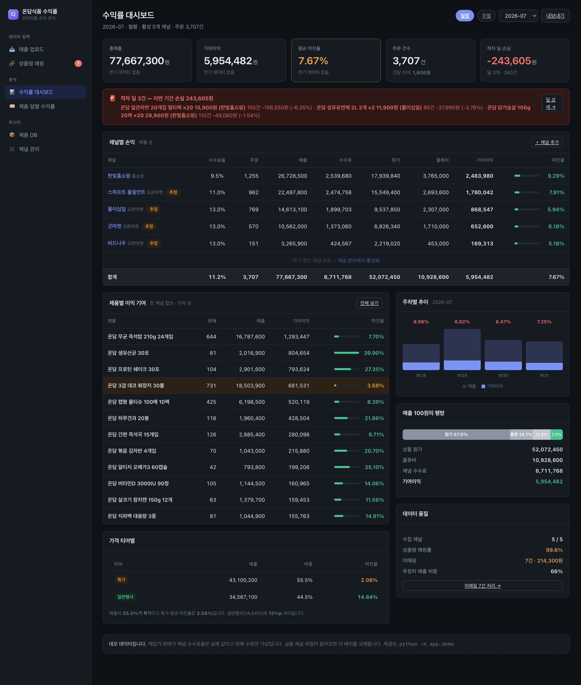
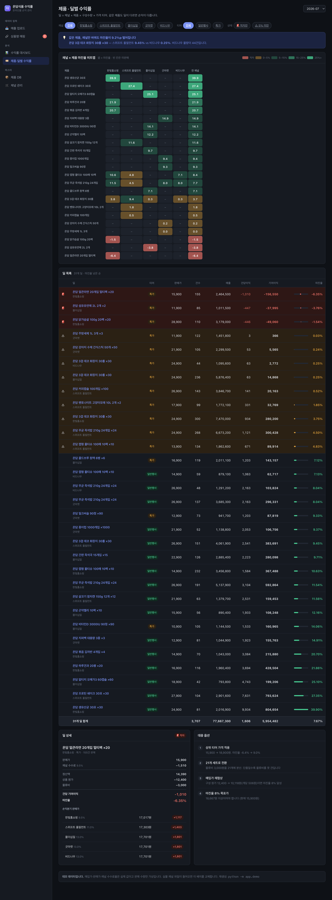
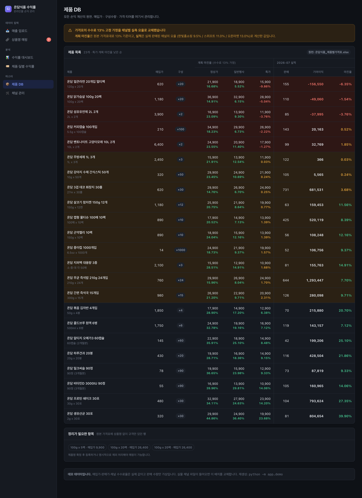
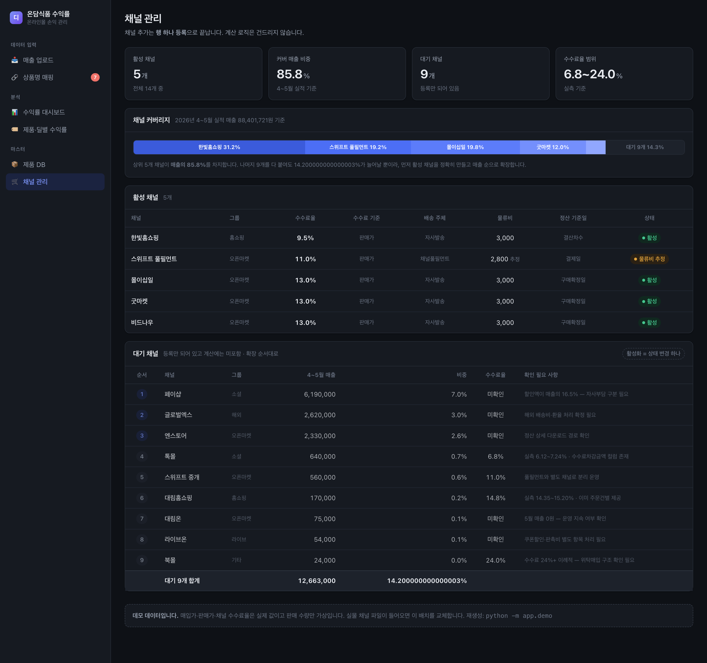
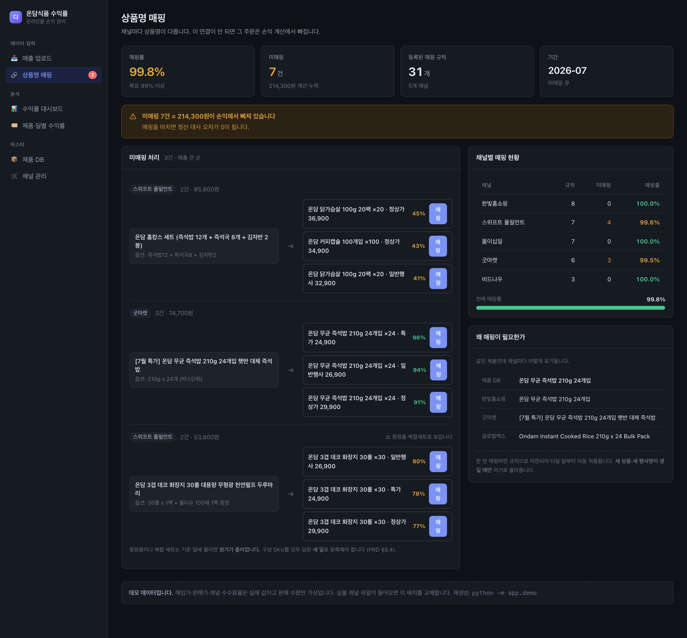
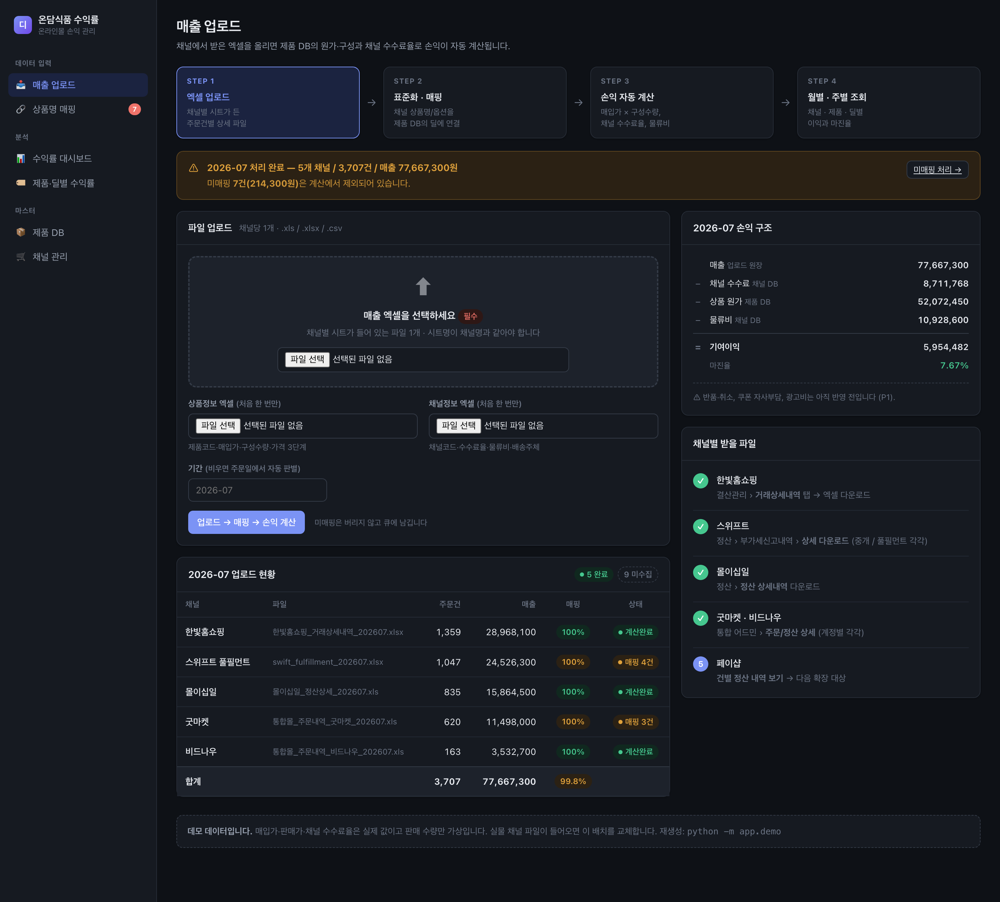

# 온라인몰 수익률 관리 시스템 — 프로그램 소개

> **엑셀 3장을 넣으면 그 달에 실제로 얼마가 남았는지 알려주는 웹 도구.**
>
> ⚠ 아래 모든 화면과 숫자는 **가상(목업) 데이터**입니다.
> 회사·브랜드·제품·채널·금액이 전부 지어낸 것이며 실존 기업과 무관합니다.
> 손익 구조만 실무와 같게 설계했습니다.

---

## 1. 이 도구가 푸는 문제

온라인몰을 파는 회사는 **총매출은 압니다. 이익을 모릅니다.**

```
질문:  "이번 달 7,766만원 팔았는데, 얼마 남았어요?"
대답:  "…엑셀 좀 보고 알려드릴게요."
```

모르는 이유는 셋입니다.

| | |
|---|---|
| **채널마다 수수료가 다르다** | 6.8% ~ 24.0%. 그런데 다들 "대충 13%"로 가정합니다 |
| **채널마다 상품명이 다르다** | 그래서 제품 단위로 합산이 안 됩니다 |
| **원가·물류비가 빠져 있다** | 매출만 보고 "잘 팔린다"고 판단합니다 |

결과는 하나입니다 — **팔수록 손해인 제품을 모르고 계속 팝니다.**

이 도구는 그걸 숫자로 드러냅니다.

```
📦 01_상품정보.xlsx   ─┐
🛒 02_채널정보.xlsx   ─┼─→  표준화 · 매핑 · 손익 계산  ─→  📊 대시보드 + 📗 결과 엑셀
🧾 03_매출_2026-07.xlsx ─┘
```

①②는 한 번 만들면 거의 안 바뀌는 **마스터**, ③만 매달 새로 들어오는 **원장**입니다.

---

## 2. 화면 여섯 장

### ① 수익률 대시보드 — 이번 달, 얼마 남았나



한 화면에서 그 달의 손익이 끝납니다.

```
총매출 77,667,300원 · 기여이익 5,954,482원 · 마진율 7.67% · 주문 3,707건
```

**매출 100원의 행방**이 이 화면의 핵심입니다.

| | |
|---|---:|
| 상품 원가 | 67.0% |
| 물류비 | 14.1% |
| 채널 수수료 | 11.2% |
| **기여이익** | **7.7%** |

100원을 팔면 7.7원이 남습니다. 그리고 그 얇은 이익을 **적자 딜 3건이 갉아먹고 있습니다** —
350건 팔아 243,605원 손실. 화면 맨 위 빨간 박스가 그걸 매달 들이댑니다.

우측 하단 **데이터 품질** 패널도 눈여겨볼 곳입니다.
미매핑 7건(214,300원)이 계산에서 빠져 있다는 걸 숨기지 않고 상시 노출합니다.

### ② 제품·딜별 수익률 — 어디서 새는가



**채널 × 제품 히트맵**이 이 도구에서 가장 많이 쓰이는 화면입니다.
한 행을 가로로 읽으면 같은 제품의 채널별 마진율이 보입니다.

> **온담 3겹 데코 화장지 30롤**
> 스위프트 풀필먼트 **9.45%** vs 비드나우 **0.25%** — 같은 제품, 같은 가격, **9.2%p 차이**

바뀐 건 채널 수수료율 하나뿐입니다. 어디에 물량을 실을지 정할 근거가 됩니다.

아래 **딜 상세**는 한 건을 완전히 분해합니다.

```
온담 얼큰라면 20개입 멀티팩 · 특가 · 한빛홈쇼핑

  판매가              15,900
  − 채널 수수료 9.5%   −1,510
  ─────────────────────────
  정산액              14,390
  − 상품 원가         −12,400   (620원 × 20개입)
  − 물류비             −3,000
  ─────────────────────────
  건당 기여이익        −1,010     마진율 −6.35%
```

그리고 **손익분기 판매가**를 채널별로 역산해 줍니다.

| 채널 | 수수료율 | 본전 가격 | 현재가 대비 |
|---|---:|---:|---:|
| 한빛홈쇼핑 | 9.5% | 17,017 | +1,117 |
| 스위프트 풀필먼트 | 11.0% | 17,303 | +1,403 |
| 몰이십일 · 굿마켓 · 비드나우 | 13.0% | 17,701 | +1,801 |

"올려야 한다"가 아니라 **"얼마나 올려야 하는지"**를 말해 줍니다.

### ③ 제품 DB — 원가와 구성수량



모든 손익 계산의 원천입니다. 제품 23종의 매입가·구성수량·가격 3단계.

**구성수량이 이 화면의 함정입니다.** 오픈마켓 묶음 상품은 구성이 `×20`, `×30`, `×1000`처럼 큽니다.

```
원가 = 매입가 × 구성수량
     = 760원 × 24개입 = 18,240원   (즉석밥)
     = 14원 × 1000개  = 14,000원   (종이컵)
```

여기를 빼먹으면 원가가 수십~수백 배 작아지고 **23종 전부가 흑자로 보입니다.**
실무에서 가장 흔하고, 가장 조용히 틀리는 지점입니다.

화면은 **계획 마진율(수수료 13% 가정)** 과 **실적 마진율(채널 실측 요율)** 을 나란히 보여줍니다.
가격표가 13%로 가정하고 만들어진 경우, 그 가정이 채널별로 얼마나 빗나가는지가 여기서 드러납니다.

### ④ 채널 관리 — 수수료가 이익을 결정한다



채널 14개(운영 5 · 대기 9)의 수수료율·물류비·배송주체·정산기준일.

**요율 근거를 `실측`과 `추정`으로 구분**하는 게 이 화면의 규칙입니다.

```
실측 수수료율 = 수수료(이용료) 합계 ÷ 매출 합계     ← 정산서에서 역산
```

계약서의 명목 요율이 아니라 **실제로 떼인 금액**으로 계산해야 맞습니다.
추정값으로 낸 이익을 실측처럼 보여주면 잘못된 결정을 부르기 때문에,
`ESTIMATE`인 채널에만 화면에 `추정` 배지가 붙습니다.

### ⑤ 상품명 매핑 — 버리지 않는다



오픈마켓 상품명은 검색 키워드를 잔뜩 붙여 등록합니다.

```
제품 DB:   온담 무균 즉석밥 210g 24개입
매출 파일: [7월 특가] 온담 무균 즉석밥 210g 24개입 햇반 대체 즉석밥
```

글자가 안 맞으면 **미매핑 큐**로 갑니다. 조용히 버리지 않습니다 — 버리면 매출이 증발하니까요.
화면은 이름·가격·구성수량 유사도로 후보를 점수와 함께 띄우고, 한 번 매핑하면 규칙으로 저장돼 다음 달부터 자동 적용됩니다.

> **증정품·복합세트는 경고를 띄웁니다.**
> "화장지 30롤 + 물티슈 1팩 증정" 같은 구성을 기존 딜에 붙이면 증정품 원가가 통째로 빠집니다.
> 구성이 다르면 **새 딜**로 등록해야 합니다.

### ⑥ 매출 업로드 — 엑셀 3장을 넣는 곳



```
엑셀 업로드 → 표준화·매핑 → 손익 자동 계산 → 월별·주별 조회
```

매출 파일은 **채널별 시트**로 되어 있고 **컬럼 이름이 전부 다릅니다.**

| 논리 필드 | 한빛홈쇼핑 | 스위프트 | 몰이십일 | 굿마켓·비드나우 |
|---|---|---|---|---|
| 주문일 | 주문일자 | 결제일 | 구매확정일 | 주문일 |
| 상품명 | 상품명 | 노출상품명 | 상품명 | 주문상품 |
| 판매금액 | 판매금액 | 결제금액 | 상품금액 | 정산금액 |
| 수수료 | 수수료 | **없음** | 서비스이용료 | **없음** |

실수가 아니라 현실입니다. 시스템은 컬럼명을 직접 찾지 않고 **키워드 표**로 해석하기 때문에,
채널이 어드민을 개편해도 키워드만 추가하면 됩니다.
**필수 컬럼이 없으면 예외를 냅니다** — 빈 값으로 채우면 매출이 증발하니까요.

수수료 컬럼은 5개 채널 중 2곳만 줍니다. 나머지는 채널 요율로 계산합니다.

---

## 3. 어떻게 계산하나

주문 **한 줄마다** 이 순서로 계산하고, 결과를 그 행에 **스냅샷으로 저장**합니다.

```
순매출   = 판매금액                          (취소면 0)
수수료   = 실적값 우선, 없으면 순매출 × 채널 요율
원가     = Σ(구성 SKU × 판매일 기준 매입가) × 판매수량
물류비   = 채널 배송비 모델 × 판매수량
기여이익 = 순매출 − 수수료 − 자사부담할인 − 원가 − 물류비
마진율   = 기여이익 ÷ 순매출
```

지키는 규칙 넷:

| 규칙 | 이유 |
|---|---|
| 계산 결과는 스냅샷으로 저장 | 매입가·요율을 나중에 바꿔도 과거 손익이 변하면 안 됨 |
| 매입가·요율은 UPDATE 금지, 이력 행 추가 | 시점 조회로 그때의 원가를 그대로 재현 |
| 증정품도 원가에 포함 | 빼면 이익이 과대 계상됨 |
| 금액은 원 단위 정수 | 0.1원이 3,700줄 쌓이면 합계가 안 맞음 |

---

## 4. 이 달의 데이터가 말해 준 것

숫자를 넣고 나면 이런 것들이 나옵니다. 셋 다 **매출만 봐서는 절대 안 보이는** 것들입니다.

### ① 매출 1위와 이익 1위는 다르다

| 제품 | 매출 | 기여이익 | 마진율 |
|---|---:|---:|---:|
| 온담 무균 즉석밥 24개입 | 16,787,600 | 1,293,447 | 7.70% |
| 온담 생유산균 30포 | 2,016,900 | 804,654 | **39.90%** |

즉석밥이 **매출은 8배**인데 **이익은 1.6배**입니다.
매출 순위로 상품을 밀면 정확히 거꾸로 가게 됩니다.

### ② 매출이 가장 높은 주의 마진율이 가장 낮다

| 주차 | 매출 | 마진율 |
|---|---:|---:|
| 2026-W28 | 15,341,100 | 8.98% |
| **2026-W29** | **26,242,400** ← 최고 | **6.62%** ← 최저 |
| 2026-W30 | 18,301,900 | 8.47% |
| 2026-W31 | 17,781,900 | 7.25% |

행사로 특가 비중이 올라갔기 때문입니다.
이번 달 매출의 **55.5%가 특가**이고, 특가 평균 마진율은 **2.08%** — 일반행사(14.64%)와 **13%p** 차이입니다.

> "이번 주 매출 최고 기록!"이 좋은 소식이 아닐 수 있습니다.

### ③ 매출 상위 품목이 적자일 수 있다

| 채널 | 제품 | 판매 | 매출 | 기여이익 |
|---|---|---:|---:|---:|
| 한빛홈쇼핑 | 온담 얼큰라면 20개입 멀티팩 | 155 | 2,464,500 | **−156,550** |
| 한빛홈쇼핑 | 온담 닭가슴살 100g 20팩 | 110 | 3,179,000 | −49,060 |
| 몰이십일 | 온담 섬유유연제 2L 2개 | 85 | 1,011,500 | −37,995 |

닭가슴살은 매출 318만원으로 이 달 상위권인데 **이익은 마이너스**입니다.
매출 기여도가 높은 품목이 적자인 게 가장 위험한 조합입니다 — 많이 팔릴수록 손실이 커집니다.

---

## 5. 시작하기

```bash
python3 -m venv .venv && .venv/bin/pip install -r requirements.txt
```

```bash
.venv/bin/python -m app.cli init && .venv/bin/python -m app.demo
```

```bash
.venv/bin/python -m uvicorn app.web:app --reload --port 8010
```

→ http://127.0.0.1:8010

화면 기획만 먼저 보려면 브라우저로 [mock/index.html](../mock/index.html) 을 여세요.

### 자기 데이터로 바꾸려면

1. `01_상품정보.xlsx` 를 자기 회사 제품으로 교체
2. `02_채널정보.xlsx` 에 정산서에서 역산한 실측 수수료율 입력
3. 지난달 매출 파일과 함께 `/upload` 에 올리기

그리고 **적자 딜이 나오는지 보세요.** 거의 모든 회사에 하나 이상 있습니다.
그걸 찾는 게 이 도구의 존재 이유입니다.

---

## 6. 더 읽을 것

| 문서 | 내용 |
|---|---|
| [PRD.md](PRD.md) | 개발 명세 — 입력·계산·화면·검수 기준 |
| [목업데이터-소개.md](목업데이터-소개.md) | 상품 DB · 채널 DB · 매출 데이터 · 결과 리포트 |
| [lecture/README.md](lecture/README.md) | 바이브코딩 수업 진행 순서 |
| [lecture/바이브코딩-시작하기.md](lecture/바이브코딩-시작하기.md) | 입문자용 8단계 가이드 |
| [../CLAUDE.md](../CLAUDE.md) | 인계 문서 — 설계 규칙과 다음 작업 |

이 저장소는 **바이브코딩 수업 교보재**를 겸합니다.
수강생은 [PRD.md](PRD.md)를 AI에게 주고 이 시스템을 직접 만들어 봅니다.
